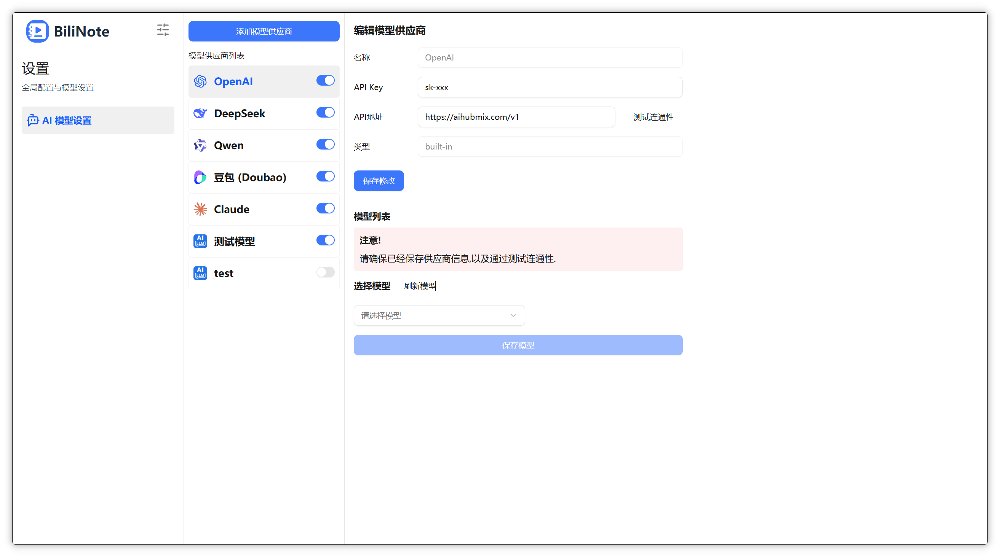
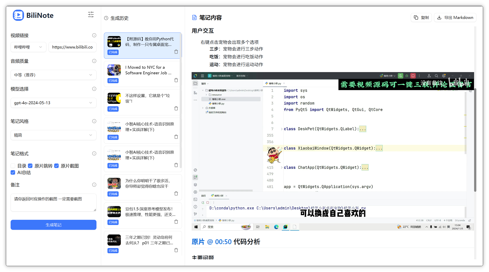
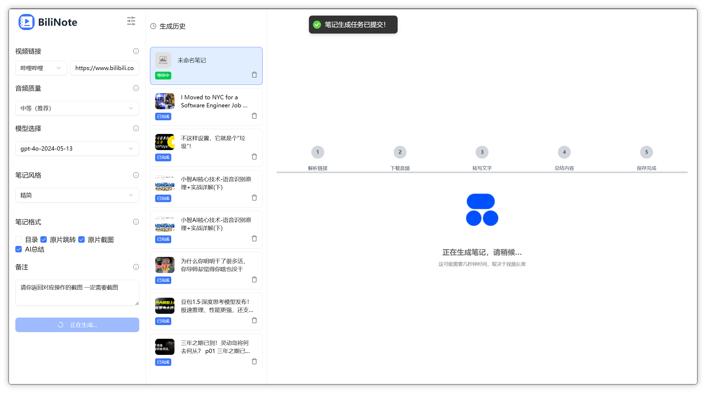
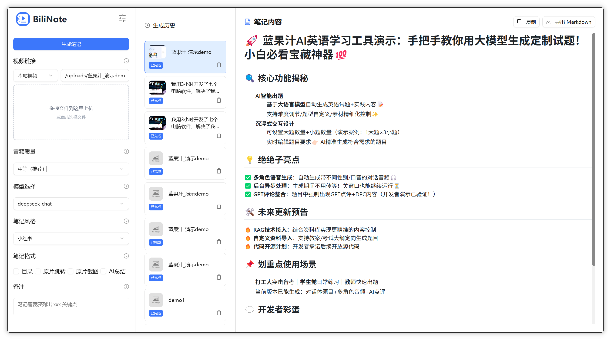

<div style="display: flex; justify-content: center; align-items: center; gap: 10px;
">
    <p align="center">
  
</p>
<h1 align="center" > BiliNote v2.3.4</h1>
</div>

<p align="center"><i>AI 视频笔记生成工具 让 AI 为你的视频做笔记</i></p>

<p align="center">
  
  
  
  
  
  
  
</p>

<p align="center">
  <a href="https://www.bilinote.app/"><b>🚀 BiliNote Pro · 在线版</b></a>
</p>

<p align="center">
  <b>不想折腾部署？</b>访问 <a href="https://www.bilinote.app/"><b>www.bilinote.app</b></a> 即开即用 —— 免安装、免配置环境、免下模型，注册即可把视频转成笔记。
  <br/>
  本地部署遇到的依赖、代理、模型下载这些坑，云端版统统不用管。
</p>

<p align="center">
  <a href="https://www.bilinote.app/">
    
  </a>
</p>


## ✨ 项目简介

BiliNote 是一个开源的 AI 视频笔记助手，支持通过哔哩哔哩、YouTube、抖音等视频链接，自动提取内容并生成结构清晰、重点明确的 Markdown 格式笔记。支持插入截图、原片跳转、AI 问答等功能。

> 💡 **想直接用、不想本地部署？** —— [BiliNote Pro 在线版 www.bilinote.app](https://www.bilinote.app/) 已上线，云端托管、开箱即用，省去依赖安装 / 代理配置 / 模型下载的全部麻烦。

## 🌐 在线使用（推荐）

直接访问 **[www.bilinote.app](https://www.bilinote.app/)** 即可使用 BiliNote Pro 在线版，无需本地部署。

## 📝 使用文档
详细文档可以查看[这里](https://docs.bilinote.app/)
## 📦 桌面版下载
本项目提供了 Windows 和 macOS 桌面客户端，可在 [Releases](https://github.com/JefferyHcool/BiliNote/releases) 页面下载最新版本。

> Windows 用户请注意：一定要在没有中文路径的环境下运行。

## 💎 BiliNote AI笔记系统一对一搭建服务

提供 **BiliNote AI笔记系统一对一搭建服务**：专人一对一远程协助，从环境部署、模型配置到上手使用全程陪跑，帮你快速跑通整套系统。扫码添加微信，备注「搭建服务」即可咨询：

<table align="center">
  <tr>
    <td align="center"><br/>BiliNote AI笔记系统一对一搭建服务</td>
  </tr>
</table>

## 🔧 功能特性

- 支持多平台：Bilibili、YouTube、本地视频、抖音、快手
- 支持返回笔记格式选择
- 支持笔记风格选择
- 支持多模态视频理解
- 支持多版本记录保留
- 支持自行配置 GPT 大模型（OpenAI、DeepSeek、Qwen 等）
- 本地模型音频转写（支持 Fast-Whisper、MLX-Whisper、Groq、BCut）
- GPT 大模型总结视频内容
- 自动生成结构化 Markdown 笔记
- 可选插入截图（自动截取）
- 可选内容跳转链接（关联原视频）
- 任务记录与历史回看
- 基于 RAG 的笔记内容 AI 问答（支持 Function Calling）
- 笔记顶部视频封面 Banner 展示
- 工作区和生成历史面板支持折叠/展开

### v2.3.0 新增

- 全局代理：一处配置同时作用于 AI 模型接口、转写接口（Groq 等）、YouTube 下载（设置 → 下载配置页），支持 `HTTP_PROXY` 环境变量兜底
- 转写模型就绪门禁：本地引擎模型没下载好时拦截视频任务，引导先去下载，不再静默卡在首次下载
- 桌面端后端健康监控韧性：退出自动清理 sidecar、启动失败展示原因 + 日志、不再无限「加载中」
- whisper 模型损坏自愈：`model.bin` 截断时自动删除重下；空 API Key / 新模型 temperature 不兼容给出清晰提示
- Docker 部署韧性：`BASE_REGISTRY` 可换国内镜像源、restart 策略修正、`.env.example` 端口与默认模型修正、新增部署 FAQ

### v2.2.3 修订

- 修：vite build 在 CI 中报 'Rollup failed to resolve import @tauri-apps/api/event'（缺直接依赖声明）

### v2.2.2 修订

- 修复 v2.2.0 桌面端 Tauri 构建失败（main.yml 的 pnpm 版本没 pin，pnpm 11 不兼容 Node 20）

### v2.2.1 修订

- 修复 v2.2.0 ghcr.io 镜像构建失败（pnpm@latest 拉到 11，与 Node 20 不兼容；pin 到 pnpm 9.15.0）

### v2.2.0 新增

- **浏览器插件**笔记选项与 web 端完整对齐：style 9 个预设下拉、format 4 个 checkbox、extras 文本框、多模态视频理解开关
- **桌面客户端**首启 4 步引导（连通自检 → 供应商/模型 → 转写引擎 → Cookie 提示）
- **桌面客户端**右下角后端运行状态指示，点开看日志、一键重启
- **桌面客户端**启动期主动检测中文 / 空格 / 不可写安装路径，弹横幅告警
- Whisper 默认 size 从 medium（~1.5GB）改为 tiny（~75MB）；切大模型时显式 confirm
- 修：whisper 半成品模型目录死循环；`/deploy_status` 在没装 torch 的部署 500
- 详见 [CHANGELOG.md](./CHANGELOG.md)

### v2.1.4 修订

- CI：桌面端 Tauri 构建去掉 Linux（17m+ 慢线退役；Linux 用户继续走 Docker 镜像）
- CI：commitlint workflow 修复 + 规范 release merge commit 标题约定

### v2.1.3 修订

- 修复 DeepSeek 等非多模态供应商被 400 拒绝的问题（issue #282）：`UniversalGPT` 的 message builder 按是否带图切换 string / 多模态数组形态
- 感谢 @voidborne-d (#345)

### v2.1.2 修订

- 修复 v2.1.1 触发的 ghcr.io Docker 镜像构建失败（Node 18 + Tailwind v4 不兼容、缺 lockfile）
- README 补上微信群二维码

### v2.1.1 修订

- 工程化与文档收尾：CONTRIBUTING.md / RELEASING.md / issue + PR 模板 / commitlint CI / 插件发版工作流
- 关于页群聊二维码：换成最新版，改为 import 本地资源，不再依赖 CDN
- 关于页移除 QQ 群入口（仅保留微信群）
- 详见 [CHANGELOG.md](./CHANGELOG.md)

### v2.1.0 新增

- 浏览器插件（Chrome / Edge / Firefox MV3）—— 工具栏 popup、视频页悬浮按钮、右键菜单、侧边栏（Markdown / 思维导图 / AI 问答）四件套
- 插件设置页五大块：模型供应商 CRUD、音频转写配置、下载配置（含浏览器 Cookie 一键同步）、部署监控
- B 站字幕优先：插件在用户浏览器里直接抓字幕（带本地登录态 cookie），跳过后端音频转写
- 后端 `BilibiliSubtitleFetcher`：非插件场景下走 player API 拿字幕，作为 yt-dlp 兜底
- mlx-whisper 仓库 ID 修正（修复模型 404）
- 后端 CORS 改用 regex，兼容浏览器扩展源
- 详见 [CHANGELOG.md](./CHANGELOG.md)

### v2.0.0 新增

- 基于 RAG 的笔记内容 AI 问答功能，支持半屏/全屏模式
- AI 问答支持 Function Calling，模型可主动查询原文数据
- RAG 索引支持视频元信息（标题、作者、简介、标签等）
- AI 回复支持 Markdown 渲染
- 笔记顶部新增视频封面 Banner
- 工作区和生成历史面板支持折叠/展开
- 笔记开头添加来源链接功能
- YouTube 字幕优先获取，有字幕时跳过音频下载
- 性能优化与转写器配置改进

## 📸 截图预览






## 🚀 快速开始

### 方式一：Docker 部署（推荐）

确保已安装 Docker，直接拉取预构建镜像运行：

```bash
docker pull ghcr.io/jefferyhcool/bilinote:latest

docker run -d -p 80:80 \
  -v bilinote-data:/app/backend/data \
  -v bilinote-config:/app/backend/config \
  -v bilinote-static:/app/backend/static \
  -v bilinote-models:/app/backend/models \
  --name bilinote \
  ghcr.io/jefferyhcool/bilinote:latest
```

上面四个卷分别持久化：`data`（SQLite 数据库 + 生成的笔记）、`config`（LLM 供应商配置 / Cookie / 转写设置）、`static`（笔记引用的视频截图）、`models`（Whisper 模型缓存，可选，避免每次重新下载）。这样 `docker pull` 升级新镜像、删旧容器重建后，配置和历史都不会丢。

> ⚠️ **不要**用 `-v 卷名:/app/backend` 挂整个后端目录——命名卷会用首次启动时的镜像内容固化，之后 `docker pull` 升级也会被旧代码盖住，导致「升级不生效」。只挂上面这些数据子目录即可。

访问：`http://localhost`

也可以使用 docker-compose 本地构建：

```bash
cp .env.example .env       # 第一次部署务必先创建 .env，否则 BACKEND_PORT/APP_PORT 等变量为空会启动失败
docker-compose up --build -d

# GPU 加速部署（需要 NVIDIA GPU + NVIDIA Container Toolkit）
docker-compose -f docker-compose.gpu.yml up --build -d
```

#### Docker 部署常见问题（FAQ）

社区反馈最集中的几个坑，遇到先按下面排查：

**0. 国内拉不到 docker.io（build 阶段报 `dial tcp ... i/o timeout`）**

`docker-compose build` 拉 `python:3.11-slim` / `node:20-alpine` / `nginx:1.25-alpine` 时连 `auth.docker.io` 超时。三种解法，按推荐顺序：

- **方法 A：直接用预构建镜像（最省事）**——不要本地 build，跳到上面的 `docker pull ghcr.io/jefferyhcool/bilinote:latest` 路径，ghcr.io 在国内通常比 docker.io 顺。
- **方法 B：配置 Docker daemon 镜像加速器**——编辑 `~/.docker/daemon.json`（Linux 在 `/etc/docker/daemon.json`），加：
  ```json
  {
    "registry-mirrors": ["https://docker.m.daocloud.io"]
  }
  ```
  然后重启 Docker Desktop / `sudo systemctl restart docker`。这是一劳永逸的做法。
- **方法 C：临时切换 base image 镜像源**——本项目所有 Dockerfile 都暴露了 `BASE_REGISTRY` build-arg：
  ```bash
  BASE_REGISTRY=docker.m.daocloud.io docker-compose build
  docker-compose up -d
  ```
  或永久写到 `.env`：`echo 'BASE_REGISTRY=docker.m.daocloud.io' >> .env`。

注意：Chinese 公共 docker 镜像源时常被关停，2025-2026 之间可用的列表会变；如果 `docker.m.daocloud.io` 不通，搜一下"Docker 镜像加速 可用"找最新可用源即可。

**1. 容器一直 restart / unhealthy**

先看后端日志：
```bash
docker logs -f bilinote-backend
```
后端启动会按顺序打印 `[startup 1/5] ... [startup 5/5] 启动完成`。若日志卡在某一步或出现 `[startup FAILED]`，就是那一步的问题，常见：
- **卡在 `[startup 3/5]`**：转写器配置读不到。检查 `.env` 里 `TRANSCRIBER_TYPE` 是否写错，`mlx-whisper` 只能在 Apple Silicon 用，Linux/Docker 请用 `fast-whisper` 或 `groq`。
- **首次跑视频时容器被 kill**：whisper 模型下载触发 OOM。先把 `.env` 里 `WHISPER_MODEL_SIZE` 改成 `tiny`，跑通后再去前端「音频转写配置」里逐档升。

**2. 改了 `.env` 没生效**

区分两类变量：
- `VITE_*` 是**构建时**变量（前端 bundle 里硬编码），改完必须 `docker-compose build frontend && docker-compose up -d`。只 `restart` 不会重新打包。
- 其他后端变量（`TRANSCRIBER_TYPE`、`WHISPER_MODEL_SIZE`、`FFMPEG_BIN_PATH` 等）是**运行时**变量，改完 `docker-compose up -d` 即可。

注意：**LLM API key 不要写 `.env`**，从前端「模型供应商」页面录入，会保存到 SQLite 数据库并持久化。

**3. 数据存在哪？删容器会丢吗？**

`docker-compose` 用的是 `./backend:/app` 绑挂，下面这些文件都在宿主机的 `./backend/` 目录里、删容器不会丢：
- `./backend/bili_note.db` —— SQLite 库（含 LLM 供应商配置、笔记历史）
- `./backend/config/transcriber.json` —— 转写器运行时配置
- `./backend/static/screenshots/` —— 视频截图
- `./backend/uploads/` —— 上传的本地视频

要彻底重置就 `docker-compose down && rm backend/bili_note.db backend/config/transcriber.json`。

**4. 前端打开是空白页 / 报 502**

通常是 nginx 起来了但 backend 还没 healthy。`docker ps` 看 backend 容器 STATUS 是不是 `(healthy)`；若长期 `(unhealthy)`，按问题 1 排查后端日志。

**5. 不要用 `restart: on-failure:N`**

如果你 fork 后改过 compose 文件、把 restart 策略改成了 `on-failure:3`：任何 3 次连续崩溃都会让容器永远不再启动，之后改 `.env` 也没用。本项目自带的 compose 已经统一用 `unless-stopped`。

### 方式二：源码部署

#### 1. 克隆仓库

```bash
git clone https://github.com/JefferyHcool/BiliNote.git
cd BiliNote
mv .env.example .env
```

#### 2. 启动后端（FastAPI）

```bash
cd backend
pip install -r requirements.txt
python main.py
```

#### 3. 启动前端（Vite + React）

```bash
cd BillNote_frontend
pnpm install
pnpm dev
```

访问：`http://localhost:3015`

## ⚙️ 依赖说明

### 🎬 FFmpeg
本项目依赖 ffmpeg 用于音频处理与转码，源码部署时必须安装：
```bash
# Mac (brew)
brew install ffmpeg

# Ubuntu / Debian
sudo apt install ffmpeg

# Windows
# 请从官网下载安装：https://ffmpeg.org/download.html
```
> ⚠️ 若系统无法识别 ffmpeg，请将其加入系统环境变量 PATH
>
> Docker 部署已内置 FFmpeg，无需额外安装。

### 🚀 CUDA 加速（可选）
若你希望更快地执行音频转写任务，可使用具备 NVIDIA GPU 的机器，并启用 fast-whisper + CUDA 加速版本：

具体 `fast-whisper` 配置方法，请参考：[fast-whisper 项目地址](http://github.com/SYSTRAN/faster-whisper#requirements)

### 🐳 使用 Docker 一键部署

确保你已安装 Docker，然后直接拉取预构建镜像运行：

```bash
# 拉取最新镜像
docker pull ghcr.io/jefferyhcool/bilinote:latest

# 运行容器
docker run -d -p 80:80 \
  -v bilinote-data:/app/backend/data \
  -v bilinote-config:/app/backend/config \
  -v bilinote-static:/app/backend/static \
  -v bilinote-models:/app/backend/models \
  --name bilinote \
  ghcr.io/jefferyhcool/bilinote:latest
```

上面四个卷分别持久化：`data`（SQLite 数据库 + 生成的笔记）、`config`（LLM 供应商配置 / Cookie / 转写设置）、`static`（笔记引用的视频截图）、`models`（Whisper 模型缓存，可选，避免每次重新下载）。这样 `docker pull` 升级新镜像、删旧容器重建后，配置和历史都不会丢。

> ⚠️ **不要**用 `-v 卷名:/app/backend` 挂整个后端目录——命名卷会用首次启动时的镜像内容固化，之后 `docker pull` 升级也会被旧代码盖住，导致「升级不生效」。只挂上面这些数据子目录即可。

访问：`http://localhost`

也可以使用 docker-compose 本地构建：

```bash
# 标准部署
docker-compose up -d

# GPU 加速部署（需要 NVIDIA GPU）
docker-compose -f docker-compose.gpu.yml up -d
```

## 🧠 TODO

- [x] 支持抖音及快手等视频平台
- [x] 支持前端设置切换 AI 模型切换、语音转文字模型
- [x] AI 摘要风格自定义（学术风、口语风、重点提取等）
- [x] 加入更多模型支持
- [x] 加入更多音频转文本模型支持
- [x] 基于 RAG 的笔记内容 AI 问答
- [ ] 笔记导出为 PDF / Word / Notion

### Contact and Join-联系和加入社区

扫码加入 BiliNote 交流微信群（共 5 个群，任选一个即可；二维码会定期更新，如已失效请到 [Issues](https://github.com/JefferyHcool/BiliNote/issues) 反馈）：

<table align="center">
  <tr>
    <td align="center"><br/>交流群 1</td>
    <td align="center"><br/>交流群 2</td>
    <td align="center"><br/>交流群 3</td>
  </tr>
  <tr>
    <td align="center"><br/>交流群 4</td>
    <td align="center"><br/>交流群 5</td>
    <td></td>
  </tr>
</table>


## 🔎代码参考
- 本项目中的 `抖音下载功能` 部分代码参考引用自：[Evil0ctal/Douyin_TikTok_Download_API](https://github.com/Evil0ctal/Douyin_TikTok_Download_API)

## 📜 License

MIT License

---

💬 你的支持与反馈是我持续优化的动力！欢迎 PR、提 issue、Star ⭐️
## Buy Me a Coffee / 捐赠
如果你觉得项目对你有帮助，考虑支持我一下吧
<div style='display:inline;'>
    
    
</div>

## ⭐ Star History

[](https://www.star-history.com/#JefferyHcool/BiliNote&Date)
