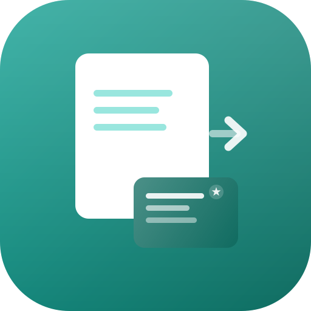
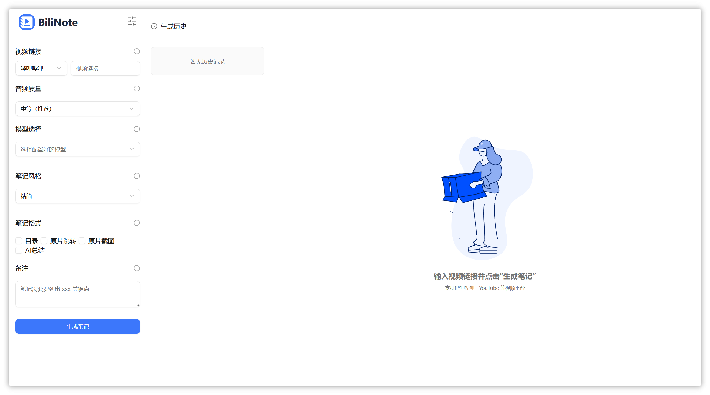
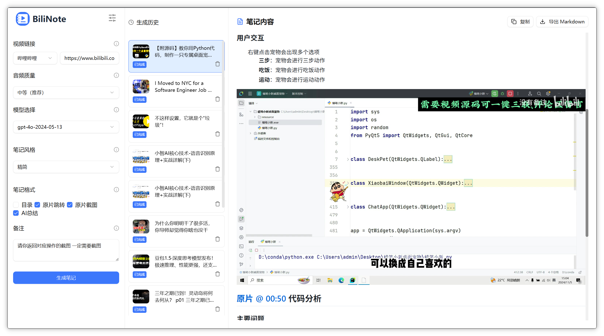
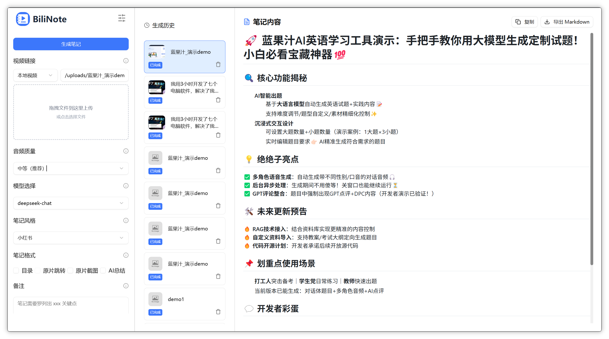

<p align="center">
  
</p>

<h1 align="center">NoteFlow v1.0.0</h1>

<p align="center"><i>一条视频链接，变成一份可检索、可追问、可管理的 AI 笔记。</i></p>

<p align="center">
  
  
  
  
  
  
  
</p>

<p align="center">
  <a href="https://www.noteflow.app/"><b>NoteFlow Pro 在线版</b></a>
  ·
  <a href="https://github.com/yunbocheng4379/NoteFlow/releases"><b>桌面版下载</b></a>
  ·
  <a href="./docs/DEPLOYMENT.md"><b>部署文档</b></a>
</p>

## 项目简介

NoteFlow 是一个 AI 视频笔记系统，支持从 Bilibili、YouTube、抖音、快手、本地视频等来源解析内容，自动转写音频并生成结构化 Markdown 笔记。生成后的笔记可以进入知识库向量索引，用于跨笔记 AI 问答、引用来源追踪、笔记合集管理和后续导出。

如果你只想直接使用，不想处理 Docker、代理、FFmpeg、Whisper 模型下载和服务器配置，可以访问 **[www.noteflow.app](https://www.noteflow.app/)** 使用在线版。

## 核心能力

### 视频转笔记

- 支持在线视频链接和本地视频上传。
- 自动识别平台，支持 Bilibili、YouTube、抖音、快手等视频来源。
- 支持 Fast-Whisper、MLX-Whisper、Groq、BCut 等音频转写方案。
- 支持选择笔记风格、笔记格式、补充说明、截图插入、原片跳转链接。
- 支持视频理解、多模态截图分析和生成过程任务状态追踪。

### AI 模型与成本控制

- 支持 OpenAI-compatible 模型供应商，可接入 DeepSeek、Qwen、Kimi、MiniMax、Claude、Gemini、Groq 等模型。
- 模型列表展示供应商 Logo，支持普通模型 / Pro 模型分层。
- 支持深度思考开关，并根据模型能力自动禁用不支持的选项。
- 支持电力余额、套餐充值、会员订阅和账单流水。

### 知识库与笔记管理

- 生成笔记后自动写入向量库，并维护索引状态。
- 知识库支持跨笔记 AI 问答、选择指定笔记范围、深度思考展示、引用来源折叠展示。
- 支持笔记合集，将同一课程、主题或批量生成的笔记集中管理。
- 支持笔记重命名、编辑后自动重建向量索引。
- 支持任务列表、生成历史、多版本记录和历史回看。

### 管理后台

- AI 模型供应商管理、模型启用和模型等级配置。
- 音频转写配置和 Whisper 模型下载管理。
- Cookie 池管理：多平台 Cookie、分组、权重、失败计数、失效标记和池耗尽提醒。
- 用户管理、反馈管理、系统通知、部署监控、更新日志管理。
- 支持支付宝 / 微信支付渠道配置与订单状态同步。

## 截图预览







## 快速开始

### 方式一：Docker Compose 部署（推荐）

先准备 Docker 和 Docker Compose Plugin，然后在项目根目录执行：

```bash
cp .env.example .env
docker compose up -d --build
```

默认访问地址：

```text
http://localhost:3015
```

GPU 版本：

```bash
docker compose -f docker-compose.gpu.yml up -d --build
```

正式服务器部署、首次部署、二次更新部署、数据库导入、Docker 镜像源等内容请查看：

[docs/DEPLOYMENT.md](./docs/DEPLOYMENT.md)

### 方式二：源码运行

后端：

```bash
cd backend
pip install -r requirements.txt
python main.py
```

前端：

```bash
cd NoteFlow_frontend
pnpm install
pnpm dev
```

访问：

```text
http://localhost:3015
```

## 常用命令

后端测试：

```bash
cd backend
pytest
```

前端构建：

```bash
cd NoteFlow_frontend
pnpm build
```

浏览器扩展：

```bash
cd NoteFlow_extension
pnpm install
pnpm dev
pnpm build
```

桌面端打包：

```bash
cd backend && ./build.sh
cd NoteFlow_frontend && pnpm tauri build
```

## 目录结构

```text
NoteFlow
├── backend/              # FastAPI 后端、任务队列、下载器、转写、LLM、RAG、数据库
├── NoteFlow_frontend/    # React 19 + Vite 前端
├── NoteFlow_extension/   # 浏览器扩展
├── docs/                 # 部署和设计文档
├── doc/                  # README 图片和社区二维码
├── docker-compose.yml    # 标准 Docker 部署
└── docker-compose.gpu.yml
```

## 关键依赖

- Python 3.11+
- Node.js 20+
- MySQL 8+
- FFmpeg
- ChromaDB
- Docker / Docker Compose
- 可选：NVIDIA GPU + NVIDIA Container Toolkit

Docker 部署已内置 FFmpeg；源码部署需要自行安装 FFmpeg。

## Docker 常见问题

### 国内拉取 Docker Hub 超时

可在 Docker daemon 中配置镜像加速器，例如：

```json
{
  "registry-mirrors": ["https://docker.m.daocloud.io"]
}
```

也可以临时使用项目 Dockerfile 提供的 `BASE_REGISTRY`：

```bash
BASE_REGISTRY=docker.m.daocloud.io docker compose build
docker compose up -d
```

### 修改 `.env` 后没有生效

- `VITE_*` 是前端构建时变量，修改后需要重新 build 前端镜像。
- 后端运行时变量通常 `docker compose up -d` 即可生效。
- LLM API Key 建议在前端模型供应商页面配置，不要写入 `.env`。

### 数据持久化位置

Docker Compose 使用 named volumes 保存数据：

- `noteflow_mysql_data`：MySQL 数据
- `noteflow_backend_note_results`：生成笔记和转写结果
- `noteflow_backend_vector_db`：知识库向量索引
- `noteflow_backend_models`：Whisper 模型缓存
- `noteflow_backend_uploads`：上传文件
- `noteflow_backend_static`：截图等静态资源
- `noteflow_backend_logs`：后端日志

彻底清空数据：

```bash
docker compose down -v
```

正式环境请谨慎执行。

## NoteFlow AI 笔记系统一对一搭建服务

提供 NoteFlow AI 笔记系统一对一搭建服务：专人远程协助完成服务器部署、Docker 配置、模型接入、Cookie 池配置、支付配置和上线检查。扫码添加微信，备注「搭建服务」即可咨询：

<table align="center">
  <tr>
    <td align="center">
      
      <br/>
      NoteFlow AI 笔记系统一对一搭建服务
    </td>
  </tr>
</table>

## 交流社区

扫码加入 NoteFlow 交流微信群。二维码会定期更新，如已失效请到 [Issues](https://github.com/yunbocheng4379/NoteFlow/issues) 反馈。

<table align="center">
  <tr>
    <td align="center"><br/>交流群 1</td>
    <td align="center"><br/>交流群 2</td>
    <td align="center"><br/>交流群 3</td>
  </tr>
  <tr>
    <td align="center"><br/>交流群 4</td>
    <td align="center"><br/>交流群 5</td>
    <td></td>
  </tr>
</table>

## 代码参考

- 抖音下载功能部分代码参考：[Evil0ctal/Douyin_TikTok_Download_API](https://github.com/Evil0ctal/Douyin_TikTok_Download_API)

## License

MIT License

## Buy Me a Coffee / 捐赠

如果你觉得项目对你有帮助，可以支持一下：

<div style='display:inline;'>
    
    
</div>

## Star History

[](https://www.star-history.com/#yunbocheng4379/NoteFlow&Date)
