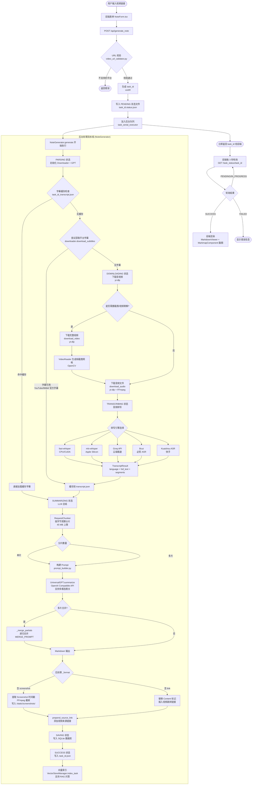

# BiliNote 视频笔记生成流程分析

## 概述

用户输入视频链接后，系统经过 **URL 解析 → 字幕/音频获取 → 语音转写 → LLM 总结 → 后处理 → 向量索引** 六大环节，最终返回结构化的 Markdown 笔记。

---

## 完整流程图



---

## 各环节技术细节

### 1. 接入层 — FastAPI 路由

| 文件 | 职责 |
|------|------|
| `app/routers/note.py` | 接收请求、URL 校验、创建 task_id、写 PENDING 状态、注册后台任务 |
| `app/services/task_serial_executor.py` | 串行任务队列，保证同一时刻只有一个视频在处理（防止 OOM）|
| `app/validators/video_url_validator.py` | 正则匹配判断平台归属（B站/YouTube/抖音/快手）|

### 2. 字幕获取 — 三级优先策略

```
缓存文件 (task_id_transcript.json)
    ↓ 无命中
平台官方字幕 (downloader.download_subtitles)
    ↓ 无字幕
下载音频 → ASR 转写
```

有字幕时仅提取元信息，**不下载音视频文件**，大幅缩短处理时间。

### 3. 下载层 — yt-dlp + 平台适配器

| 平台 | 下载器 | 特殊处理 |
|------|--------|---------|
| Bilibili | `BilibiliDownloader` | Cookie 注入（支持高清/会员视频）|
| YouTube | `YoutubeDownloader` | 优先复用已有字幕，跳过音频下载 |
| 抖音 | `DouyinDownloader` | yt-dlp 抓取 |
| 快手 | 直接调用快手 ASR API | — |
| 本地文件 | `LocalDownloader` | 直接读取 |

FFmpeg 负责音视频分离与截帧，启动时通过 `ffmpeg_helper.ensure_ffmpeg_or_raise` 强制检查。

### 4. 语音转写 — 多引擎工厂

```python
# transcriber_provider.py — 单例缓存，按需懒加载
get_transcriber(transcriber_type="fast-whisper", model_size="base", device="cuda")
```

| 引擎 | 适用场景 |
|------|---------|
| **fast-whisper** | 通用，支持 CPU/GPU |
| **mlx-whisper** | Apple Silicon，速度最快 |
| **Groq** | 云端 API，无本地算力要求 |
| **Bcut** | 必剪 ASR，中文效果好 |
| **Kuaishou** | 快手平台专用 |

输出统一格式：`TranscriptResult(language, full_text, segments[{start, end, text}])`

### 5. LLM 总结 — 分片 + 合并

**核心问题**：长视频转写文本可能超出 LLM 单次请求上限（默认 45 MB）。

**解决方案**：`RequestChunker` 按字节二分切割 segments，每片独立调用 LLM，再递归合并（类 MapReduce）。

```
[完整 segments] → Chunk 1 → LLM → Partial 1 ─┐
                → Chunk 2 → LLM → Partial 2 ─┤→ Merge LLM → 最终 Markdown
                → Chunk N → LLM → Partial N ─┘
```

断点续传：每个 chunk 完成后写 `.gpt.checkpoint.json`，任务失败可从断点重试，不重跑已完成的分片。

**Prompt 构成**（`prompt_builder.py`）：
- 基础：视频标题 + 带时间戳的转写文本 + 标签
- 格式扩展：TOC / 原片跳转链接 / 截图标记 / AI 总结
- 风格扩展：精简 / 详细 / 学术 / 小红书 / 会议纪要等 9 种

所有 LLM 提供商统一走 OpenAI Compatible 接口（`OpenAICompatibleProvider`），支持 DeepSeek、Qwen、本地 Ollama 等。

### 6. 后处理

| 功能 | 实现 |
|------|------|
| **截图插入** | GPT 在 Markdown 中输出 `*Screenshot-[mm:ss]` 占位符，后处理用 FFmpeg 截帧生成图片，替换为 `` |
| **视频跳转链接** | GPT 输出 `*Content-[mm:ss]`，后处理替换为平台专属跳转 URL |
| **来源链接** | `prepend_source_link` 在笔记最顶部追加原始视频链接 |

### 7. 向量索引 — RAG 问答

笔记生成成功后异步建立向量索引（`VectorStoreManager.index_task`），索引失败不影响笔记展示。用于 `chat.py` 路由提供的 AI 问答功能（RAG + Function Calling）。

### 8. 任务状态机

```
PENDING → PARSING → DOWNLOADING → TRANSCRIBING → SUMMARIZING → SAVING → SUCCESS
                                                                          ↓ (任意阶段异常)
                                                                        FAILED
```

状态通过原子文件写入（先写 `.tmp` 再 rename）保证一致性，前端每 3 秒轮询 `GET /task_status/{task_id}`。

---

## 关键技术栈总结

| 层次 | 技术 |
|------|------|
| Web 框架 | FastAPI + Pydantic + BackgroundTasks |
| 视频下载 | yt-dlp |
| 音视频处理 | FFmpeg |
| 语音识别 | faster-whisper / mlx-whisper / Groq / Bcut |
| LLM 接入 | OpenAI Compatible API（支持所有兼容提供商）|
| 数据库 | SQLite + SQLAlchemy |
| 向量检索 | VectorStoreManager（RAG 问答）|
| 前端 | React 19 + Zustand + react-i18next |
| 状态轮询 | useTaskPolling（3 秒间隔）|
| 脑图渲染 | Markmap |
